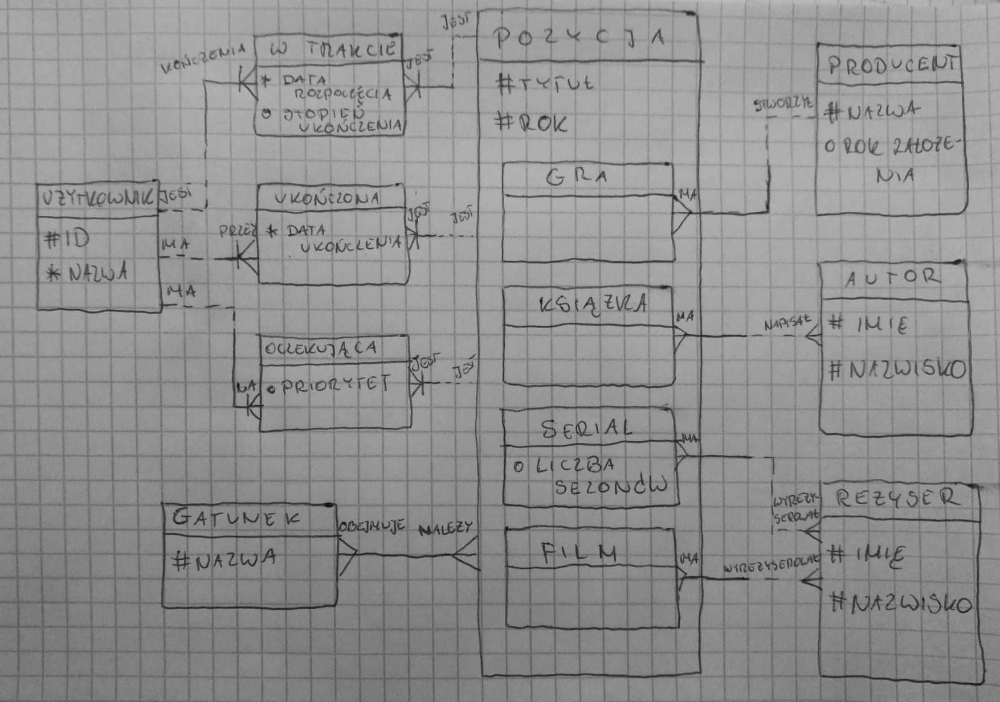
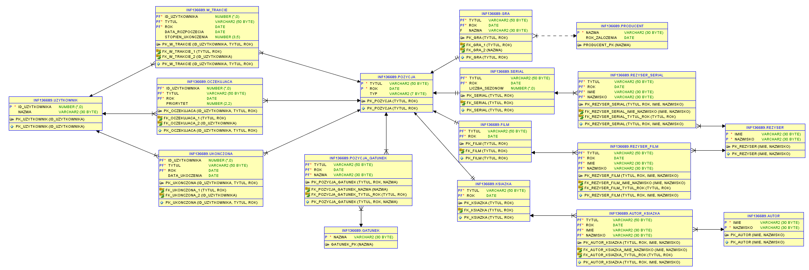

# SBD_FunManager

# Opis funkcjonalności:
	Program umożliwiający zapisywanie filmów/seriali/gier/książek
	, ocenianie ich i umieszczanie na listach w zależności od stopnia
	ukończenia.

# Encje:

# Diagram relacji:

	

