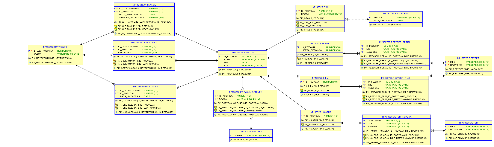

# SBD_FunManager

# Opis funkcjonalności:
	Program umożliwiający zapisywanie filmów/seriali/gier/książek
	, ocenianie ich i umieszczanie na listach w zależności od stopnia
	ukończenia.

# Encje:

# Diagram relacji:

	
# Planowane Procedury
	- wstaw(Ksiazka/Gra/Film/Serial)
	- wstaw(Autor/Rezyser/Producent)
	- wstaw(Oczekujaca/W_trakcie/Ukonczona)
	- Przenies(Oczekujaca_do_w_trakcie/W_trakcie_do_ukonczone/Oczekujaca_do_ukonczona)

## TODO
	* Poprawne wyświetlanie wielu gatunków (HOME)
		* Pozycja z dwoma lub wiecej gatunkami wyswietla sie jako dwa lub wiecej rekordów, powinna jako jeden ze zagregowanymi gatunkami
	* Dodanie komunikatów o błędach do wszystkeigo
	* Poprawne wyświetlanie wielu autorów książek i wielu reżyserów filmów
	* Usunięcie wszystkich rekordów i dodanie od nowa (już na czysto jakieś przykładowe książki, filmy, gry, gatunki i twórcy) to też nam posłuży jako test co można poprawić
	* W Gatunki -> Zarządzaj przydzieleniem gatunków, niezakodowana funkcja przycisku "ołówka"
	*- W zakładce Twórcy przy łączeniu twórcy z dziełem imię nie idzie w parze z nazwiskiem
	- Aby po 'Dodaj *' -> 'Dodaj Nową Pozycję' -> 'Dodaj *' przekierowywało do HOME, a nie pozostawiało w 'Dodaj Pozycję'
	- Ładniejsze 'lub' pomiędzy wybieraniem pozycji, a przyciskiem 'Dodaj nową pozycję' na ekranie Dodaj Oczekujące/W trakcie/Ukończone
	- Jakieś drobne poprawki typu zmiana nazw jakichś pól itp
